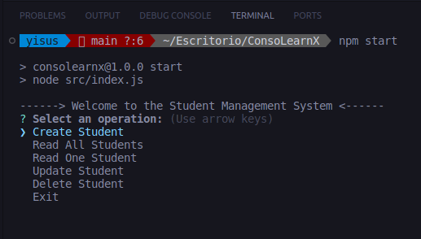
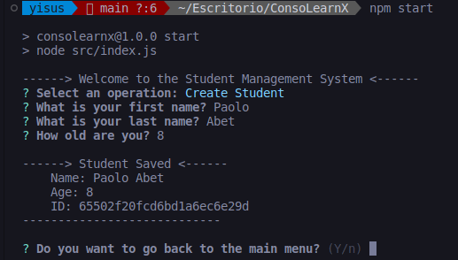

# Console-learn-x

Este proyecto es un sistema CRUD desarrollado en Node.js y MongoDB para gestionar la información de estudiantes en una escuela primaria. La aplicación se ejecuta a través de la consola y proporciona funcionalidades básicas para la creación, lectura, actualización y eliminación de registros de estudiantes.




## Características

- **Registro de Estudiantes:** Añade nuevos estudiantes con información relevante.
- **Consulta de Estudiantes:** Lee la información de todos los estudiantes almacenados.
- **Consulta de un Estudiante:** Lee la información de un estudiante.
- **Actualización de Datos:** Modifica la información de un estudiante existente.
- **Eliminación de Registros:** Elimina estudiantes de la base de datos.

# Instalación

Para ejecutar este proyecto en tu máquina local, sigue estos pasos:

## 1. Clona este repositorio en tu máquina local.

```bash
git clone https://github.com/yisusAbet24/Console-learn-x.git
```

## 2. instalar las dependencias.

```bash
npm install
```

## 3. Renombra el archivo .env.example a .env.

## 4. **Configuración de Variables de Entorno en el archivo `.env`:**

Asegúrate de configurar las siguientes variables de entorno en el archivo `.env` para que tu aplicación funcione correctamente:

- MONGO_URL: La URL de la base de datos MongoDB.

# 6. **Iniciar la Aplicación:**

Para poner en marcha la aplicación, utiliza el siguiente comando:

```bash
npm start
```
